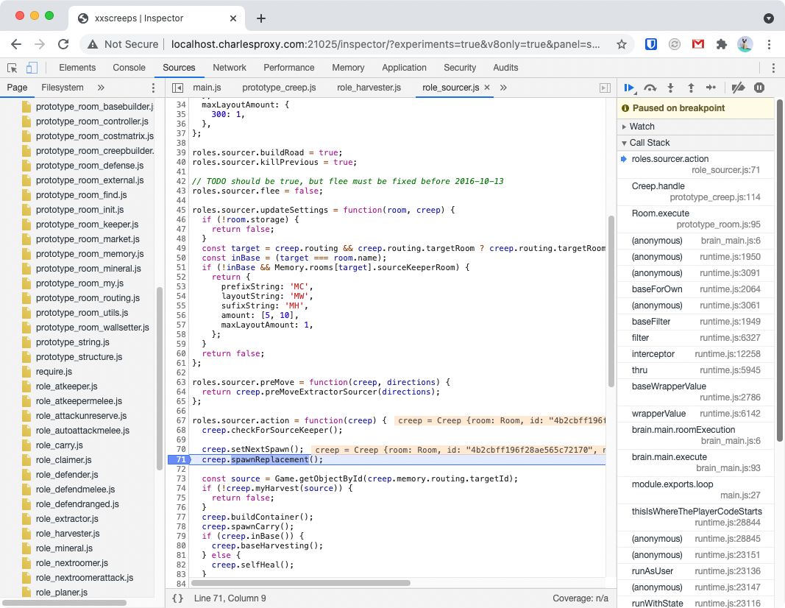

# xxscreeps debugger & inspector

## About
This package provides a debugger interface for player scripts on
[xxscreeps](https://github.com/laverdet/xxscreeps). This uses the v8 inspector API under
[isolated-vm](https://github.com/laverdet/isolated-vm) running with a bundled copy of [Chrome Devtools
Frontend](https://github.com/ChromeDevTools/devtools-frontend).

## Installation
To use this package you can run `npm install '@xxscreeps/inspector'` and add
`'@xxscreeps/inspector'` to your `mods` configuration in `.screepsrc.yaml`. This module must be
installed as a peer to xxscreeps!

You can view the inspector at: http://localhost:21025/inspector/.

